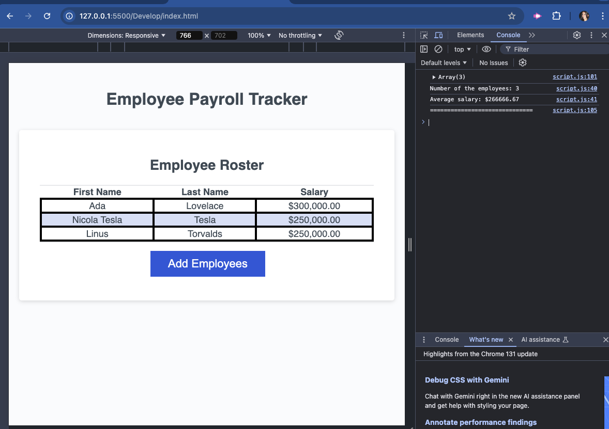

# Employee Payroll Tracker

This is a browser-based application designed to help payroll managers track employee payroll data, calculate average salaries, and display employee rosters. The interface is clean and responsive, providing an intuitive user experience.

---

## Table of Contents

- [Description](#description)
- [Features](#features)
- [Technologies Used](#technologies-used)
- [How to Use](#how-to-use)
- [Live Demo](#live-demo)
- [Screenshots](#screenshots)
- [Future Enhancements](#future-enhancements)
- [License](#license)

---

## Description

The **Employee Payroll Tracker** allows payroll managers to:
1. Add employee data (first name, last name, and salary).
2. View employee data displayed in an HTML table.
3. Calculate and display the average salary of employees.
4. Select and display a random employee.

---

## Features

- **Dynamic Employee Management**: Add multiple employees with an interactive prompt.
- **Data Display**: Employee data is displayed in a clean HTML table.
- **Average Salary Calculation**: Automatically calculates the average salary and logs it to the console.
- **Random Employee Selector**: Randomly selects and displays an employee from the roster.
- **Responsive Design**: Adapts to different screen sizes for seamless usage.

---

## Technologies Used

- **HTML5**: For the structure of the application.
- **CSS3**: For responsive design and styling.
- **JavaScript**: For dynamic data handling and interactivity.

---

## How to Use

1. Open the application in your browser.
2. Click on the **"Add Employees"** button.
3. Follow the prompts to enter the employee's:
   - First Name
   - Last Name
   - Salary
4. Confirm if you want to add another employee or stop.
5. View the sorted employee list on the page, and check the average salary and random employee details in the console.

---

## Live Demo

You can view the live application here: [Employee Payroll Tracker](#)

---

## Screenshots

### Adding Employees

### Console Output

---

## Future Enhancements

- Add a feature to delete employees from the roster.
- Implement salary editing directly from the table.
- Add persistent data storage using Local Storage or a database.
- Include form-based input for better usability.

---

## License

This project is licensed under the MIT License.

